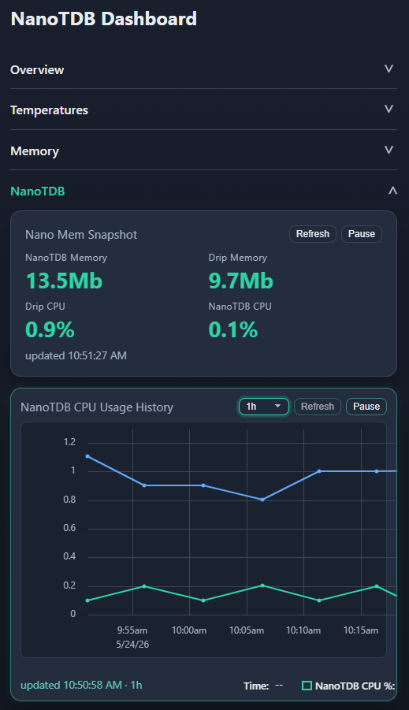
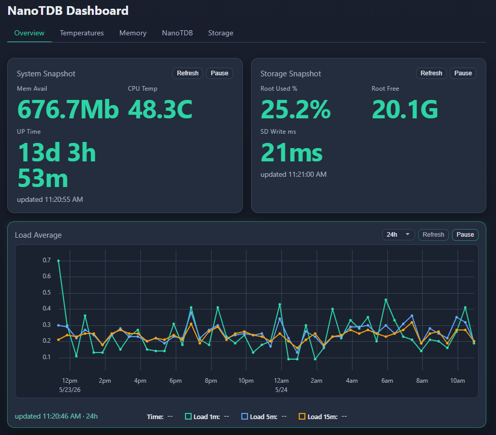
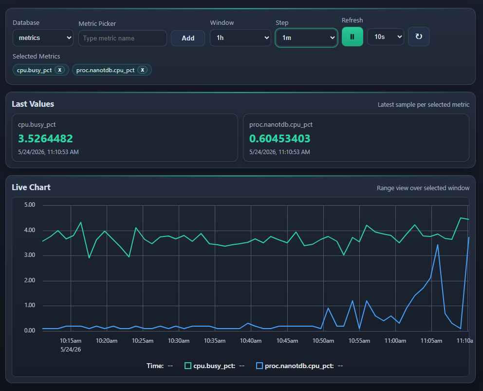
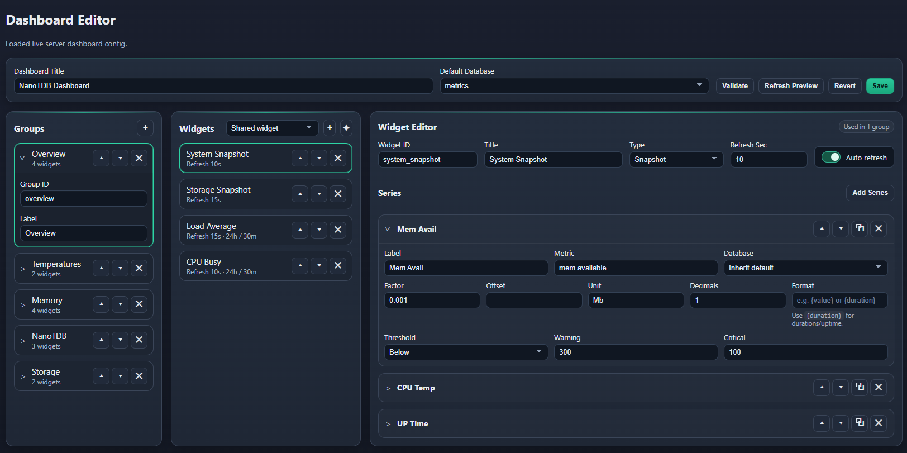

# Dashboard

NanoTDB includes a lightweight browser UI served by the `internal/web` package.
The UI stays thin on the server side and does its rendering and refresh behavior
in the browser.

The dashboard is mobile-friendly and works for both narrow phone-width layouts
and wider desktop-style layouts.

## Screenshots

### Dashboard (Mobile-Friendly)



> Caption: Compact mobile-width dashboard for quick CPU, memory, disk, and sensor checks.

### Dashboard (Wide Desktop Layout)



> Caption: Wider desktop dashboard layout for broader operational views and denser widget placement.

### Explore



> Caption: Ad hoc metric exploration with a wide metric picker, last-value cards, and a live chart.

### Dashboard Editor



> Caption: In-browser editor for groups, widgets, series, preview, validation, and save.

In-browser editor for groups, widgets, series, preview, validation, and save.

## Pages

- `/` and `/dashboard` serve the configurable dashboard.
- `/dashboard/edit` serves the in-browser dashboard editor.
- `/explore` serves the manual database and metric explorer.
- `/engine` serves the operational engine view for database, file, runtime, and active settings inspection.

## Getting Started

Initialize a data directory:

```bash
./nanotdb --init --config ~/nanotdb-data/engine.toml
```

That creates:

- `engine.toml` for server configuration.
- `dashboard.json` for the default dashboard layout.

Start the server:

```bash
./nanotdb --config ~/nanotdb-data/engine.toml
```

Then open:

- `http://localhost:8428/`
- `http://localhost:8428/dashboard`
- `http://localhost:8428/dashboard/edit`
- `http://localhost:8428/explore`
- `http://localhost:8428/engine`

## Dashboard Config

`dashboard.json` is file-backed and editable. The embedded default sample is tuned
to the metric names emitted by `drip` in [cmd/drip/drip.toml](../cmd/drip/drip.toml).

Example:

```json
{
  "title": "NanoTDB Dashboard",
  "default_db": "metrics",
  "groups": [
    {
      "id": "overview",
      "label": "Overview",
      "widgets": ["system_snapshot", "load_history", "storage_snapshot"]
    },
    {
      "id": "temperatures",
      "label": "Temperatures",
      "widgets": ["temperature_snapshot", "temperature_history"]
    }
  ],
  "widgets": {
    "system_snapshot": {
      "type": "numbers",
      "title": "System Snapshot",
      "refresh_sec": 10,
      "series": [
        { "label": "Load 1m", "metric": "sys.load1", "transform": { "decimals": 2 } },
        { "label": "Load 5m", "metric": "sys.load5", "transform": { "decimals": 2 } },
        { "label": "Mem Avail", "metric": "mem.available", "transform": { "factor": 0.000001, "unit": " GB", "decimals": 1 }, "thresholds": { "direction": "below", "warning": 1.0, "critical": 0.5 } },
        { "label": "CPU Clock", "metric": "cpu.freq_khz", "transform": { "factor": 0.000001, "unit": " GHz", "decimals": 2 } },
        { "label": "CPU Temp", "metric": "temp.cpu", "transform": { "factor": 0.001, "unit": " C", "decimals": 1 }, "thresholds": { "direction": "above", "warning": 70, "critical": 80 } }
      ]
    },
    "load_history": {
      "type": "line_chart",
      "title": "Load Average",
      "refresh_sec": 15,
      "lookback": "6h",
      "interval": "1m",
      "series": [
        { "label": "Load 1m", "metric": "sys.load1" },
        { "label": "Load 5m", "metric": "sys.load5" },
        { "label": "Load 15m", "metric": "sys.load15" }
      ]
    },
    "storage_snapshot": {
      "type": "numbers",
      "title": "Storage Snapshot",
      "refresh_sec": 15,
      "series": [
        { "label": "Root Used %", "metric": "diskfs.root.used_pct", "transform": { "unit": "%", "decimals": 1 }, "thresholds": { "direction": "above", "warning": 80, "critical": 90 } },
        { "label": "Root Free", "metric": "diskfs.root.bytes_avail", "transform": { "factor": 0.0000000009313225746154785, "unit": " GiB", "decimals": 1 }, "thresholds": { "direction": "below", "warning": 8, "critical": 4 } },
        { "label": "SD Write ms", "metric": "disk.sd_write_probe_ms", "transform": { "unit": " ms", "decimals": 1 }, "thresholds": { "direction": "above", "warning": 25, "critical": 50 } }
      ]
    },
    "temperature_snapshot": {
      "type": "numbers",
      "title": "Temperatures",
      "refresh_sec": 15,
      "series": [
        { "label": "CPU", "metric": "temp.cpu", "transform": { "factor": 0.001, "unit": " C", "decimals": 1 }, "thresholds": { "direction": "above", "warning": 70, "critical": 80 } },
        { "label": "Office Dry", "metric": "temp.office_dry.mdeg", "transform": { "factor": 0.001, "unit": " C", "decimals": 1 } },
        { "label": "Office Wet", "metric": "temp.office_wet.mdeg", "transform": { "factor": 0.001, "unit": " C", "decimals": 1 } },
        { "label": "Outdoor", "metric": "temp.out_dry.mdeg", "transform": { "factor": 0.001, "unit": " C", "decimals": 1 } }
      ]
    },
    "temperature_history": {
      "type": "line_chart",
      "title": "Temperature History",
      "refresh_sec": 30,
      "lookback": "12h",
      "interval": "2m",
      "series": [
        { "label": "CPU", "metric": "temp.cpu", "transform": { "factor": 0.001, "unit": " C", "decimals": 1 } },
        { "label": "Office Dry", "metric": "temp.office_dry.mdeg", "transform": { "factor": 0.001, "unit": " C", "decimals": 1 } },
        { "label": "Office Wet", "metric": "temp.office_wet.mdeg", "transform": { "factor": 0.001, "unit": " C", "decimals": 1 } },
        { "label": "Outdoor", "metric": "temp.out_dry.mdeg", "transform": { "factor": 0.001, "unit": " C", "decimals": 1 } }
      ]
    }
  }
}
```

UI-only display conversion is configured per series using `transform`, for example
`{"factor": 0.001, "unit": " C", "decimals": 1}` to convert millidegrees to
degrees in the browser.

Widgets can also opt out of timer-based refresh with `"auto_refresh": false`.
This is useful for long-lookback charts or historical widgets that should only
update when refreshed manually.

In the live dashboard, line-chart widgets also expose a local lookback picker in
the widget header so users can temporarily widen or narrow the visible time
window without editing `dashboard.json`.

Config shape summary:

- `title` is required.
- `default_db` sets the database used when a series does not override it.
- `groups[]` defines dashboard tabs/sections in display order.
- `groups[].widgets[]` references widget ids from the top-level `widgets` map.
- `widgets.<id>.type` currently supports `number`, `numbers`, and `line_chart`.
- Each widget must define at least one series.
- A series must define either `metric` or `measurement` + `field`.
- `line_chart` widgets require valid duration strings for `lookback` and `interval`.
- `line_chart` widgets must not contain duplicate effective labels. A duplicate
  label is any repeated explicit `label`, or repeated fallback label derived
  from `metric` or `measurement.field`.

Series support:

- `db` or `database` overrides `default_db` for a single series.
- `transform.factor`, `transform.offset`, `transform.unit`,
  `transform.decimals`, and `transform.format` are display-only changes applied
  in the browser.
- `thresholds.direction` must be `above` or `below` when warning or critical
  thresholds are set.
- Thresholds only affect number and numbers widgets. Line charts render the
  transformed values but do not apply severity coloring.

## Editor

`/dashboard/edit` loads the current server-side `dashboard.json`, lets you edit
it in-place, previews the selected group in the browser, and saves the result
back through the dashboard config API.

The editor layout has four working areas:

- Dashboard metadata for title, default database, and the Validate, Refresh
  Preview, Revert, and Save actions.
- A Groups pane for adding, renaming, reordering, and deleting groups.
- A Widgets pane for adding a new widget to the selected group or attaching an
  existing shared widget to that group.
- A Widget Editor pane for editing the selected widget and its series.

Important editor behavior:

- Widgets are reusable across groups. Adding an existing widget links the same
  widget id into another group instead of cloning it.
- The usage badge shows whether the selected widget is shared by multiple
  groups.
- The group preview is live but debounced; most edits trigger a refresh of the
  currently selected group preview after a short delay.
- `Refresh Preview` forces an immediate preview rebuild.
- The preview uses the configured widget `lookback` and `interval`. The live
  dashboard's local lookback picker is not part of the editor preview.
- There is no browser-side autosave. `Revert` restores the last config loaded
  from the server, or the last successfully saved config.
- `Save` sends the normalized draft to `PUT /api/dashboard-config`. When the
  server writes a backup of the previous file, the editor displays that backup
  path in the status row.
- `Validate` sends the draft to `POST /api/dashboard-config/validate` without
  writing the file.

Widget editor details:

- Widget ids are slugged to lowercase underscore-separated identifiers and kept
  unique when renamed or created.
- New widgets default to type `numbers`, inherit the global refresh cadence, and
  start with one series.
- Line-chart widgets expose `lookback` and `interval` fields in the editor.
- Series rows can be reordered, duplicated, and deleted.
- Series can point at a metric directly or use `measurement` + `field`.
- The editor loads the live database list and metric catalog from the NanoTDB
  API to populate database selects and metric suggestions.
- Empty transform and threshold objects are removed before save, so the emitted
  JSON stays compact.

## Web Config

The dashboard-related settings live under `[web]` in `engine.toml`:

- `enabled` enables or disables the web handlers.
- `base_path` sets the dashboard route prefix, default `/dashboard`.
- `explore_path` sets the manual explorer route prefix, default `/explore`.
- `engine_path` sets the engine explorer route prefix, default `/engine`.
- `title` sets the browser page title.
- `refresh_seconds` sets the default UI refresh cadence.
- `dashboard_config` points at the dashboard JSON file.
- `web_root` points at a filesystem directory that overrides the embedded UI bundle.
- `api_base_url` sets the absolute API base the browser should call when the UI is hosted separately.

Example:

```toml
[web]
enabled = true
base_path = "/dashboard"
explore_path = "/explore"
engine_path = "/engine"
title = "NanoTDB Dashboard"
refresh_seconds = 10
dashboard_config = "dashboard.json"
web_root = "ui"
api_base_url = ""
```

## Editable UI Assets

To export the embedded UI bundle for editing:

```bash
./nanotdb --export-web-assets ./ui
```

Then set `[web].web_root` to that directory. NanoTDB will serve these files from
disk instead of the embedded bundle:

- `dashboard.html`
- `editor.html`
- `index.html`
- `engine.html`
- `dashboard_assets/`
- `assets/`
- `engine_assets/`
- `common_assets/`

This lets you edit HTML, CSS, and JavaScript without rebuilding the Go binary.
If you host the exported UI separately from the NanoTDB process, set `[web].api_base_url`
so the browser pages call the NanoTDB API at the correct origin.

## API Endpoints Used By The UI

- `GET /api/dashboard-config`
- `POST /api/dashboard-config/validate`
- `PUT /api/dashboard-config`
- `GET /api/v1/databases`
- `GET /api/v1/metrics?db=<name>`
- `GET /api/v1/query`
- `GET /api/v1/query_range`
- `GET /api/engine/overview`
- `GET /api/engine/database?db=<name>`
- `GET /api/engine/files?db=<name>`
- `GET /api/engine/runtime?db=<name>`

## Browser Smoke Test

For a browser-level regression check of the dashboard and editor:

```bash
npm install
npx playwright install
npm run test:web-smoke
```

The smoke script starts a temporary NanoTDB server, stubs the chart library and
metric API responses in-browser, verifies dashboard widget refresh failures are
surfaced inline, and checks that editor validation rejects duplicate line-chart
labels.

## Sample Rollup Fixture

To run NanoTDB against the rollup-enabled fixture and keep appending fresh points
every 10 seconds:

```bash
./scripts/run_sample_rollup_server.sh
```

Defaults:

- root dir: `test-data/full-cycle-check`
- config: `test-data/full-cycle-check/engine.toml`
- dashboard config: `test-data/full-cycle-check/dashboard.json`
- ingest interval: `10` seconds
- base URL: `http://127.0.0.1:8428`
- metrics per tick: `10` (`temp.synthetic00` .. `temp.synthetic09`)
- source DB: `source`

Optional arguments:

```bash
./scripts/run_sample_rollup_server.sh <root-dir> <config-path> <interval-seconds> <base-url> <metric-count> <source-db>
```

This keeps the server in the foreground and prints an ingest tick log. Stop with
`Ctrl+C`.